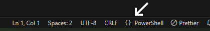

# PowerShell DSC Examples

A repo to learn and experiment with PowerShell DSC

## PowerShell DSC Modules

- [PSDscResources](https://github.com/PowerShell/PSDscResources) - In-box DSC resources that update many of the included DSC resources and adds some community contributions.
- [ComputerManagementDsc](https://github.com/dsccommunity/ComputerManagementDsc/wiki) - Resources for Domain Joins, Smb Shares, Power Plan, Time Zones, UAC, RDP, and more.
- [NetworkingDsc](https://www.powershellgallery.com/packages/NetworkingDsc/9.0.0) - Resources for managing network configuration

## Configuring Visual Studio Code for working with DSC

The examples in this repository are designed to work with PowerShell 5.1/DSC 1.1.

If you are using [Visual Studio Code](https://code.visualstudio.com/) and you have PowerShell 7 installed, VS Code will default to using PowerShell 7, which will not work for these DSC examples and give you errors in your editor window.  To change the PowerShell 5.1, click the curly braces (`{}`) just to the left of the word `PowerShell` in the lower right hand corner of the VS Code Window and use the *PowerShell Session Menu* to select PowerShell 5.1.  This should resolve and errors in the editor Window and change the terminal in VS Code to use PowerShell 5.1.



## Installing DSC Modules on Your Workstation

For anything but the most basic DSC configurations, you will need to install additional PowerShell modules on both your Workstation and any servers you want to configure using DSC.  The steps below are aimed at configuring your workstation to be able to download modules from the PowerShell gallery.

PowerShell 5.1 comes with version 1.0.0.1 of *PowerShellGet* which has very limited features and does not work properly with the PowerShell Gallery.  The page [Update PowerShellGet for Windows PowerShell 5.1](https://learn.microsoft.com/en-us/powershell/gallery/powershellget/update-powershell-51?view=powershellget-2.x) describes how to update PowerShell get.

1. **Make sure .NET Framework 4.5 or higher is installed**

    First, make sure you have [.NET Framework 4.5](https://dotnet.microsoft.com/en-us/download/dotnet-framework) or above installed.

2. **Configure PowerShell to use TLS 1.2**

    Next, make sure you are using Transport Layer Security (TLS) 1.2 or higher.  Execute the following command to configure your PowerShell session to use TLS 1.2.

    ```PowerShell
    [Net.ServicePointManager]::SecurityProtocol =
        [Net.ServicePointManager]::SecurityProtocol -bor
        [Net.SecurityProtocolType]::Tls12
    ```
  
    You can also set this command in your [PowerShell profile](https://learn.microsoft.com/en-us/powershell/module/microsoft.powershell.core/about/about_profiles?view=powershell-5.1) so that every PowerShell session will use TLS 1.2.  Typically this means adding the above command to the `$HOME\Documents\WindowsPowerShell\Profile.ps1` file.  This will use TLS 1.2 for all PowerShell sessions for the current user in all PowerShell hosts.

3. **Install the NuGet provider.**

    Run the following command to install the NuGet provider

    ```PowerShell
    Install-PackageProvider -Name NuGet -Force
    ```

4. **Configure the PowerShell Gallery as a trusted provider**

    This will allow you to download modules from the PowerShell gallery without receiving warnings that the PowerShell gallery is an untrusted repository.

    ```PowerShell
    Set-PSRepository -Name PSGallery -InstallationPolicy Trusted
    ```

5. **Use the Install-Module command to install the module**

    Use the [`Install-Module`](https://learn.microsoft.com/en-us/powershell/module/powershellget/install-module?view=powershellget-2.x) command to install the required module(s) on your workstation.  

    The following command installs version 9.0.0 the *ComputerManagementDsc* module for all users on the workstation.  This command requires administrative privelages.

    ```PowerShell
    Install-Module -Name ComputerManagementDsc -RequiredVersion 9.0.0
    ```

    You can also install modules for only the current user by using the `-Scope CurrentUser` parameter.  This is useful if you do not have administrative rights on your workstation.

    ```PowerShell
    Install-Module -Name ComputerManagementDsc -RequiredVersion 9.0.0 -Scope CurrentUser
    ```

## Installing DSC Modules on a Server

For DSC to function correctly, any DSC modules used in your configuration need to be also installed on the server being configured.  That is, if you use the *ComputerManagementDSC* module as part of a configuration for web servers, then the *ComputerManagementDSC* module needs to not just be on the workstation you used to create your DSC configuration, but all of the web servers you intend to deploy that configuration to.

It is likely that servers have restricted access to the Internet, so it may not be possible to follow the same steps outlined above for a workstation and then use [Install-Module](https://learn.microsoft.com/en-us/powershell/module/powershellget/install-module?view=powershellget-2.x) to install modules from the PowerShell gallery on your servers.  In these cases, you need to copy the modules manually to the target server before you attempt to confugure the server using DSC.

When you use [Install-Module](https://learn.microsoft.com/en-us/powershell/module/powershellget/install-module?view=powershellget-2.x) to install a module, the contents of the module will be downloaded and installed into one of two locations on your workstation depending on the options used when calling `Install-Module`.

- **C:\Program Files\WindowsPowerShell\Modules** - This is the default location when running the `Install-Module` command.  Installing modules to this location requires Administrator access.
- **USERPROFILE\Documents\WindowsPowerShell\Modules** - This is the location used if you specify a parameter of `-Scope CurrentUser` when using the Install-Module command.

When copying modules to the target server, you can find where modules are installed by examining the `$env:PSModulePath` variable.  Copy the required modules to one of the directories listed in this folder.  If copying modules to a *USERPROFILE* directory, make sure this is the profile of the user who is going to run DSC comamnds on the server.

You can verify that the modules are available on the target servery by using the [`Get-Module`](https://learn.microsoft.com/en-us/powershell/module/microsoft.powershell.core/get-module?view=powershell-5.1) command.

```PowerShell
Get-Module -ListAvailable
```

## Local Configuration Manager

The local configuration manager is the engine of Desired State Configuration.  It runs on every target server and tells the server how DSC is configured to apply changes for that computer.

You can get the current configuration of the LCM using the [`Get-DSC-LocalConfigurationManager`](https://learn.microsoft.com/en-us/powershell/module/psdesiredstateconfiguration/get-dsclocalconfigurationmanager?view=dsc-1.1) command.

```Powershell
Get-DSCLocalConfigurationManager
```

### Important LCM Settings

| Setting            | Description |
|--------------------|------------------------------------------------------------------------------------------------------------------------------------------|
| ActionAfterReboot  | Specifies what happens after a reboot during configuration.  Default value is `ContinueConfiguration`.  Can also use `StopConfiguration` |
| ConfigurationMode  | Values are `ApplyOnly`, `ApplyAndMonitor`, `ApplyAndAutoCorrect` (default).                                                             |
| RebootNodeIfNeeded | Specifies if DSC is allowed to reboot the computer if needed in order to apply configuration.                                            |
| RefreshMode        | Specifies how the LCM gets its configuration.  Default is `Push` where you put the file on the computer.  Second option is `Pull` mode.  Final option is `Disabled`.  Disabled is used when you are doing maintenance on the node |

### Setting LCM Settings in DSC

There is a special type of node called `LocalConfigurationManager` that can be used to set LCM settings for the node.  This can be included in your DSC configuration.

```powershell
LocalConfigurationManager {
    RebootNodeIfNeeded     = $True
    ConfigurationMode      = "ApplyAndAutoCorrect"
    ActionAfterReboot      = "ContinueConfiguration"
    RefreshMode            = "Push"
}
```

## Key PowerShell DSC Commands

### Get DSC Resources installed on a machine

```PowerShell
Get-DscResource
```

The output will look like the following.

```Text
ImplementedAs   Name                      ModuleName                     Version    Properties
-------------   ----                      ----------                     -------    ----------
PowerShell      Archive                   PSDesiredStateConfiguration    1.1        {Microsoft.PowerShell.DesiredState…
PowerShell      Environment               PSDesiredStateConfiguration    1.1        {Microsoft.PowerShell.DesiredState…
PowerShell      Group                     PSDesiredStateConfiguration    1.1        {Microsoft.PowerShell.DesiredState…
Composite       GroupSet                  PSDesiredStateConfiguration    1.1        {Microsoft.PowerShell.DesiredState…
Binary          Log                       PSDesiredStateConfiguration    1.1        {Microsoft.PowerShell.DesiredState…
PowerShell      Package                   PSDesiredStateConfiguration    1.1        {Microsoft.PowerShell.DesiredState…
Composite       ProcessSet                PSDesiredStateConfiguration    1.1        {Microsoft.PowerShell.DesiredState…
PowerShell      Registry                  PSDesiredStateConfiguration    1.1        {Microsoft.PowerShell.DesiredState…
PowerShell      Script                    PSDesiredStateConfiguration    1.1        {Microsoft.PowerShell.DesiredState…
PowerShell      Service                   PSDesiredStateConfiguration    1.1        {Microsoft.PowerShell.DesiredState…
```

### Get the syntax of a DSC Component

```PowerShell
Get-DscResource -Name Registry -Syntax
```

The output will look like the following

```Text
Registry [String] #ResourceName                                                                                         
{
    Key = [string]
    ValueName = [string]
    [DependsOn = [string[]]]
    [Ensure = [string]{ Absent | Present }]
    [Force = [bool]]
    [Hex = [bool]]
    [PsDscRunAsCredential = [PSCredential]]
    [ValueData = [string[]]]
    [ValueType = [string]{ Binary | Dword | ExpandString | MultiString | Qword | String }]
}

Registry [String] #ResourceName
{
    Key = [string]
    ValueName = [string]
    [DependsOn = [string[]]]
    [Ensure = [string]{ Absent | Present }]
    [Force = [bool]]
    [Hex = [bool]]
    [PsDscRunAsCredential = [PSCredential]]
    [ValueData = [string[]]]
    [ValueType = [string]{ Binary | DWord | ExpandString | MultiString | QWord | String }]
}
```

### Get the properties defined for a DSC Resource

```PowerShell
Get-DscResource Service | Select -ExpandProperty Properties
```

The output will tell you what properties are required (mandatory) and what possible values are

```Text
Name                 PropertyType   IsMandatory Values                                                                  
----                 ------------   ----------- ------                                                                  
Name                 [string]              True {}                                                                      
BuiltInAccount       [string]             False {LocalService, LocalSystem, NetworkService}                             
Credential           [PSCredential]       False {}                                                                      
Dependencies         [string[]]           False {}                                                                      
DependsOn            [string[]]           False {}                                                                      
Description          [string]             False {}                                                                      
DisplayName          [string]             False {}                                                                      
Ensure               [string]             False {Absent, Present}                                                       
Path                 [string]             False {}                                                                      
PsDscRunAsCredential [PSCredential]       False {}                                                                      
StartupType          [string]             False {Automatic, Disabled, Manual}
State                [string]             False {Running, Stopped}
Name                 [string]              True {}
BuiltInAccount       [string]             False {LocalService, LocalSystem, NetworkService}
Credential           [PSCredential]       False {}
Dependencies         [string[]]           False {}
DependsOn            [string[]]           False {}
Description          [string]             False {}
DesktopInteract      [bool]               False {}
DisplayName          [string]             False {}
Ensure               [string]             False {Absent, Present}
Path                 [string]             False {}
PsDscRunAsCredential [PSCredential]       False {}
StartupTimeout       [UInt32]             False {}
StartupType          [string]             False {Automatic, Disabled, Manual}
State                [string]             False {Ignore, Running, Stopped}
TerminateTimeout     [UInt32]             False {}

```

## Usefule Resources

- [Getting started with PowerShell Desired State Configuration (DSC)](https://octopus.com/blog/getting-started-with-powershell-dsc) by Shawn Sesna - Article on the Octopus Deploy blog